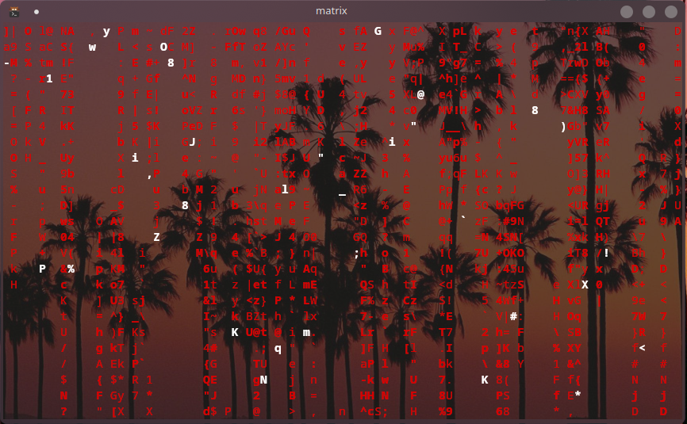

## Install my config for Neo (matrix)

<a href="https://github.com/st3w/neo">Install Neo</a>

Then edit the .bashrc file:
`nano ~/.bashrc`

Add following line:
`alias matrix="neo --charset=ascii --color=red --colorfile=$HOME/neo/examples/colorfile1.txt"`

Now edit the color file
`nano ~/neo/examples/colorfile1.txt`

The text should look like this:
```bash
neo_color_version 1

bg=NONE
160 # foreground
231 # bottom of droplet
```

Now you have my config for Neo, you just have to type `matrix`

